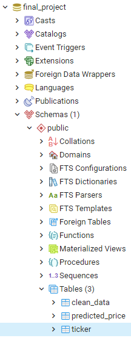
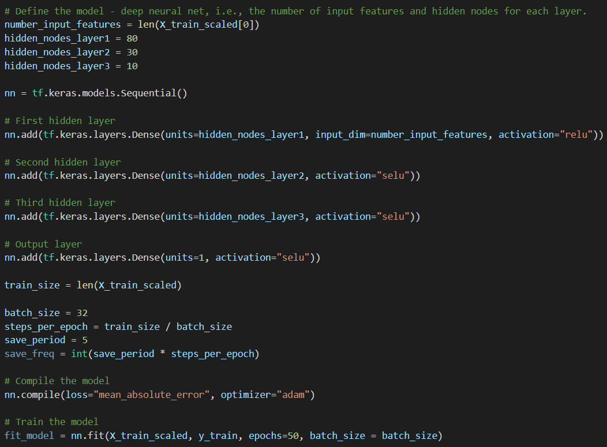
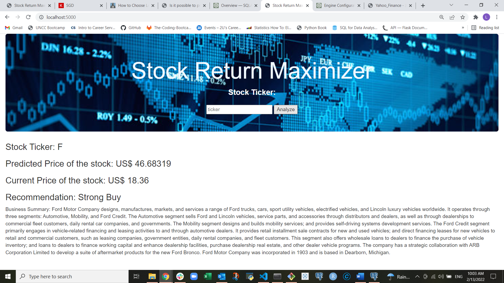

# Final_Project

Presentation Link: https://docs.google.com/presentation/d/1DhafRC4UR8gYSsYWFzmQp2ccarPR_o2Tjhe-K0d2gU8/edit?usp=sharing

## Collaborators 

The team (**Lydia Alexander**,**Muhammad Sabir**, and **Lev Levine**) has made the decision to collaborate on this project working on and submitting each area as a team.

## Overview

### Selected topic

  * Stock Price Prediction

### Reasons the topic was selected

Statistics:
- $95 trillion is the global stock market value.
- The current stock market crash interrupted a 10-year record.
- On average, the stock market performs the poorest in September.
- The US represents about 55.9% of the total global stock market capitalization.
- 55% of US adults have money in the stock market.
- About 10% of US households hold international equity.

[Source: Stock Market Statistics](https://spendmenot.com/blog/stock-market-statistics/#:~:text=Let%E2%80%99s%20see%20how%20many%20people%20invest%20in%20the,of%20Americans%20own%20stocks%2C%20the%20answer%20is%2052%25)

Top Reasons For Choosing:

  * The stock market is a data rich topic with data available for analysis to include APIs, libraries and static data to pull from. Having a large amount of data for our model will increase the liklihood of our model being successful.
  * This topic is very relevant to the maturity of the American people.  As the above statistics detail, 55% of US adults have money in the stock market, making this topic very significant to a large number of people in the US.
  * A member of our team is very involved in the day trading of the stock market and understands the business.

### Description of data sources

  - Yahoo Finance dataset on Kaggle  [https://www.kaggle.com/jerryhans/key-statistics-yahoo-finance-stocks-of-2003-2013](https://www.kaggle.com/jerryhans/key-statistics-yahoo-finance-stocks-of-2003-2013)
  - Yahoo Finance API [https://www.yahoofinanceapi.com/](https://www.yahoofinanceapi.com/)
  - yfinance Library [https://pypi.org/project/yfinance/](https://pypi.org/project/yfinance/)

### Questions the App will Answer with the Data

  * Based on the data input into the NN model, provide a data-driven buy/sell recommendation to the end user on a selected stock on their interest.

## Communications Protocol

### Cadence & Tools

The team meets at least 3 times per week: Tuesday, Thursday, and Saturday using the **Discord** Collaboration Software. 

**Github** is being actively used to share the work and manage versions. 

**Slack** is used throught the week to exchange messages.

### Team Core Areas of Responsibility

**Lydia** - Database

**Muhammad** - Github & Vusualization

**Lev** - Machine Learning & App Architecture

## Database

- A database was created using postgreSQL

    

- The machine learning module is connected to the database.

## Machine Learning Model

### Model Overview 

A provisional Deep Learning Regression Model has been developed (see **Yahoo_Finance.ipynb**)

Target Variable: **Stock Price** (Price)

Initial Feature Variables: 

- **Price per Earnings** (Trailing P/E) 
- **Earnings per Share** (Diluted EPS)
- **Return on Assets** (Return on Assets)
- **Return on Equity** (Return on Equity)
- **Price per Earnings** (Forward P/E)
- **Price/Earnings to growth Ratio** (PEG Ratio)
- **Enterprise Value/Earning Before Interest and Taxes, Depreciation, and Amortization** (Enterprise Value/EBITDA)
- **Earnings Growth** (Earnings Growth)

The model is using the **3 hidden layers**:

- hidden_nodes_layer1 = **80 neurons**
- hidden_nodes_layer2 = **30 neurons**
- hidden_nodes_layer3 = **10 neurons**

The **SELU** activation function is used on all the **Hidden layers**. 

The **RELU** activation function is used on all the **Output layer**. 

**The Neural Network Model:**

The initial model is run **50 epochs** to train and is generating **Loss: 14.63**

### Data preprosessing

- Dropped columns that did not contribute to the prediction
- Replaced NaN (null) values with mean values for each stock ticker
- Removed remaining rows that contained NaN values 
- Removed rows with outliers beyong 2 standard deviation from the mean
- Scaled the training data to Mean = 0 and STD = 1 (with Standard Scaler)

### Deep Learning Model Optimization Next Steps

- Attempt to cluster the stocks into several categories with unsupervised ML 
- Develop and fit DL models for each cluster individually 
- Experienemt with activation functions, number of hidden layers, model feature selection, number of epochs, etc

### Overall User Experience

#### A. Explore individual stock ticker (Core Product Feature)

1. Enter stock ticker
2. The backend will pull the most recent feature data and target variable data from Yahoo Finance
3. The DL Model will calculate the predicted stock price base on the most current feature data
4. The predicted and current stock price will be displayed for the user
5. If predicted stock price > current stock price, a BUY recommendation generated and vise versa

**The working prototype User Interface:**

#### B. Discover investment opportunity stocks (Optional Feature)

1. Click the "Analyze the Market" button
2. Pull the current feature data and target variable data for all the tickers in the array (>300)
3. Run the DL model to predict prices for each stock
4. Display predicted and current prices sorted in the descending order of the investment opportunity
5. Provide a recommendation on which stocks to invest

### Prototype App Deployment on HEROKU

[https://stockoptimizer.herokuapp.com/](https://stockoptimizer.herokuapp.com/)