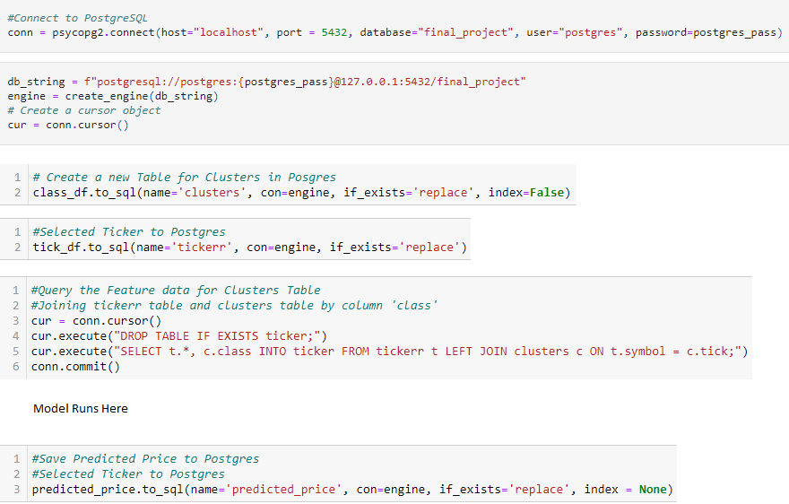
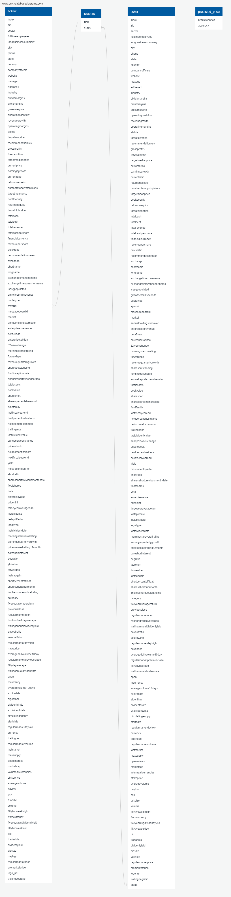

# Final_Project

Presentation Link: https://docs.google.com/presentation/d/1DhafRC4UR8gYSsYWFzmQp2ccarPR_o2Tjhe-K0d2gU8/edit?usp=sharing

Dashboard Presentation: https://docs.google.com/presentation/d/1hXU28unDzPH3O0gM9gG7vCKDZXwtV4GZLEZ8WskptY0/edit?usp=sharing

## Collaborators 

The team (**Lydia Alexander**, **Muhammad Sabir**, and **Lev Levine**) has made the decision to collaborate on this project working on and submitting each area as a team.

## Overview

### Selected topic

  * Stock Price Prediction

### Reasons the topic was selected

Statistics:
- $95 trillion is the global stock market value.
- The current stock market crash interrupted a 10-year record.
- On average, the stock market performs the poorest in September.
- The US represents about 55.9% of the total global stock market capitalization.
- 55% of US adults have money in the stock market.
- About 10% of US households hold international equity.

[Source: Stock Market Statistics](https://spendmenot.com/blog/stock-market-statistics/#:~:text=Let%E2%80%99s%20see%20how%20many%20people%20invest%20in%20the,of%20Americans%20own%20stocks%2C%20the%20answer%20is%2052%25)

Top Reasons For Choosing:

  * The stock market is a data rich topic with data available for analysis to include APIs, libraries and static data to pull from. Having a large amount of data for our model will increase the liklihood of our model being successful.
  * This topic is very relevant to the maturity of the American people.  As the above statistics detail, 55% of US adults have money in the stock market, making this topic very significant to a large number of people in the US.
  * A member of our team is very involved in the day trading of the stock market and understands the business.

### Description of data sources

  - Yahoo Finance dataset on Kaggle  [https://www.kaggle.com/jerryhans/key-statistics-yahoo-finance-stocks-of-2003-2013](https://www.kaggle.com/jerryhans/key-statistics-yahoo-finance-stocks-of-2003-2013)
  - Yahoo Finance API [https://www.yahoofinanceapi.com/](https://www.yahoofinanceapi.com/)
  - yfinance Library [https://pypi.org/project/yfinance/](https://pypi.org/project/yfinance/)

### Questions the App will Answer with the Data

  * Based on the data input into the NN model, provide a data-driven buy/sell recommendation to the end user on a selected stock on their interest.

## Communications Protocol

### Cadence & Tools

The team meets at least 3 times per week: Tuesday, Thursday, and Saturday using the **Discord** Collaboration Software. 

**Github** is being actively used to share the work and manage versions. 

**Slack** is used throught the week to exchange messages.

### Team Core Areas of Responsibility

**Lydia** - Database

**Muhammad** - Github & Vusualization

**Lev** - Machine Learning & App Architecture

## Database

A databased was created using PostgreSQL.

**ERD**

## Machine Learning Model

### Model Overview 

A provisional Deep Learning Regression Model has been developed (see **LOCAL_SERVER/ML_Model.ipynb**)

Target Variable: **Stock Price** (Price)

Initial Feature Variables: 

- DE Ratio                    float64
- Trailing P/E                float64
- Price/Sales                 float64
- Price/Book                  float64
- Profit Margin               float64
- Operating Margin            float64
- Return on Assets            float64
- Return on Equity            float64
- Revenue Per Share           float64
- Forward P/E                 float64
- PEG Ratio                   float64
- Enterprise Value/Revenue    float64
- Enterprise Value/EBITDA     float64
- Gross Profit                float64
- Diluted EPS                 float64
- Earnings Growth             float64
- Revenue Growth              float64
- Total Cash Per Share        float64
- Current Ratio               float64
- Book Value Per Share        float64
- Cash Flow                   float64
- Beta                        float64

The model is using the **3 hidden layers**:

- hidden_nodes_layer1 = **80 neurons**
- hidden_nodes_layer2 = **30 neurons**
- hidden_nodes_layer3 = **10 neurons**

The **SELU** activation function is used on all the **Hidden layers**. 

The **RELU** activation function is used on all the **Output layer**. 

**The Neural Network Model:**

The model is run **100 epochs** to train.

### Data preprosessing

- Dropped columns that did not contribute to the prediction
- Replaced NaN (null) values with mean values for each stock ticker
- Removed remaining rows that contained NaN values 
- Removed rows with outliers beyong 2 standard deviation from the mean
- Scaled the training data to Mean = 0 and STD = 1 (with Standard Scaler)

### Data Transformation

- An unsupervised machine learning model has been applied to the cleaned dataset to cluster the data into groups with similar behavioral patterns. K-Means model has been used and the Elbow Curve built.

Based on the Elbow Curve, **k=6** has been selected. We have assigned a **Cluster Class** to each Stock Ticker in the dataset accordingly.

### Model Training and Saving

For each Cluster, a unique Deep Learning Model has been trained based on the Cluster data subset. The Models for each Cluster have been saved (total of 6). The Scalers for each Cluster have been saved (total of 6).

For new stock tickers that are not part of the overall dataset and may be potentially entered by the App users, a 7th model has been trained. The 7th model is based on the overall dateset (without clustering). Both, the model and scaler have also been saved.

### Model Evaluation

Adjusted R-Square has been used to evaluate the each Model accuracy. 

The R-Square results are below.

1. Model 0: 0.34
2. Model 1: 0.23
3. Model 2: 0.71
4. Model 3: 0.99
5. Model 4: 0.37
6. Model 5: 0.62
7. Model 6: 0.33

### Overall User Experience

#### A. Explore individual stock ticker (Core Product Feature)

1. Enter stock ticker
2. The backend will pull the most recent feature data and target variable data from Yahoo Finance
3. The DL Model will calculate the predicted stock price base on the most current feature data
4. The predicted and current stock price are displayed for the user
5. If predicted stock price > current stock price, a BUY recommendation generated and vise versa

**The working Prototype 2.0 User Interface (localhost deployment):**

### Prototype 1.0 App Deployment on HEROKU (to be updated)

[https://stockoptimizer.herokuapp.com/](https://stockoptimizer.herokuapp.com/)
