# Final_Project

Presentation Link: https://docs.google.com/presentation/d/1DhafRC4UR8gYSsYWFzmQp2ccarPR_o2Tjhe-K0d2gU8/edit?usp=sharing

# Overview/Outline

### Selected topic

  * **Stock Price Prediction**

### Reasons the topic was selected

Facts & Figures:
- $95 trillion is the global stock market value.
- The current stock market crash interrupted a 10-year record.
- On average, the stock market performs the poorest in September.
- The US represents about 55.9% of the total global stock market capitalization.
- 55% of US adults have money in the stock market.
- About 10% of US households hold international equity.

[Source: Stock Market Statistics](https://spendmenot.com/blog/stock-market-statistics/#:~:text=Let%E2%80%99s%20see%20how%20many%20people%20invest%20in%20the,of%20Americans%20own%20stocks%2C%20the%20answer%20is%2052%25)

Top Reasons For Choosing:

  * The stock market is a data rich topic with data available for analysis to include APIs, libraries and static data to pull from. Having a large amount of data for our model will increase the liklihood of our model being successful.
  * This topic is very relevant to the majority of the American people. As the above statistics detail, 55% of US adults have money in the stock market, making this topic very significant to a large number of people in the US.
  * A member of our team is very involved in the day trading of the stock market and understands the business.

### Description of data sources

#### Yahoo Finance dataset on Kaggle  [https://www.kaggle.com/jerryhans/key-statistics-yahoo-finance-stocks-of-2003-2013](https://www.kaggle.com/jerryhans/key-statistics-yahoo-finance-stocks-of-2003-2013)

  The Yahoo Finance dataset from Kaggle includes key statistics of the S & P 500 ("a market-capitalization-weighted index of the 500 largest publicly traded companies in the U.S.") from 2003 - 2013. [Source: Investopedia](https://www.investopedia.com/terms/s/sp500.asp)

#### Yahoo Finance API [https://www.yahoofinanceapi.com/](https://www.yahoofinanceapi.com/)

  "Yahoo Finance API is a service that provides stock quotes and other financial information for any stock ticker symbol. It is one of the largest source of financial data available on the web, and it is updated continuously throughout the day. Yahoo Finance API covers over 37,000 stocks in more than 50 countries. Yahoo Finance is a media property that provides various financial news and data including stock details, quotes, press releases, financial reports."  [Source: Yahoo Finance API - The Complete Guide](https://blog.api.rakuten.net/api-tutorial-yahoo-finance/#:~:text=Yahoo%20Finance%20API%20is%20a%20reliable%20source%20of,Finance%20API%20can%20be%20accessed%20from%20Rakuten%20RapidAPI.)

#### yfinance Library [https://pypi.org/project/yfinance/](https://pypi.org/project/yfinance/)

  The yfinance Libarary data source "is a popular open source library developed as a means to access the financial data available on Yahoo Finance" offering a "range of market data on stocks, bonds, currencies and crytpocurrencies." [Source: yfinance Libarary - A Complete Guide](https://algotrading101.com/learn/yfinance-guide/#:~:text=What%20is%20yfinance%3F%20yfinance%20is%20a%20popular%20open,market%20data%20on%20stocks%2C%20bonds%2C%20currencies%20and%20cryptocurrencies.)


### Questions the App will Answer with the Data

  * Based on the data input into the NN model, provide a data-driven buy/sell recommendation to the end user on a selected stock on their interest.

### Description of Data Exploration

We were looking for the datasets that had numerous metrics and ratios around stock fundamentals that would enable training the model and predicting the stock price - the target variable.

The Kaggle data set contained more than 30 fields and a large number of data points sufficient to fit the neural net or machine learning model. We also extracted data from the yfinance library and official Yahoo Finance API. Both contained a rich set of data points for stock fundamentals as well as historical data.

Extracts from these data sets have been loaded into DataFrames in Jupyter Notebook, reviewed for missing and Null values, data types, descriptive statistics for each column, and any data anomalies. 

At the conclusion of the data exploration, we established that the Kaggle data set does meet the requirements as the main data set for the project machine learning / deep learning training.

The yfinance library does meet the requirements for the on-demand request of the current stock fundamentals.

### Description of the Data Analysis

We have reviewed the following potential features and analysed their impact on the predicting the stock price. 

- **DE Ratio**: The debt-to-equity (D/E) ratio compares a company's total liabilities to its shareholder equity 
- **Trailing P/E**: The price-to-earnings ratio (P/E ratio) is the ratio for valuing a company that measures its current share price relative to its earnings per share (EPS)
- **Price/Sales**: The price-to-sales ratio equals a company's market capitalization divided it by the company's total sales or revenue over the past 12 months
- **Price/Book**: The price-to-book ratio compares a company's market value to its book value                  
- **Profit Margin**: The profit margin is a ratio of a company's profit (sales minus all expenses) divided by its revenue              
- **Operating Margin**: The operating margin is the ratio of operating income to net sales            
- **Return on Assets**: The term return on assets (ROA) is a financial ratio that indicates how profitable a company is in relation to its total assets            
- **Return on Equity**: The Return on equity (ROE) is a measure of financial performance calculated by dividing net income by shareholders' equity            
- **Revenue Per Share**: The Revenue per share is a ratio that computes the total revenue earned per share over a designated period            
- **Forward P/E**: The price-earnings ratio is the ratio of a company's share price to the company's earnings per share                 
- **PEG Ratio**: The PEG ratio is a company's Price/Earnings ratio divided by its earnings growth rate                  
- **Enterprise Value/Revenue**: The Enterprise Value to Revenue Multiple equals the corporate value (equity plus debt minus cash) divided by its annual revenue    
- **Enterprise Value/EBITDA**:The Enterprise Value to EBITDA is the corporate value divided by its earnings before interest, taxes, and depreciation  
- **Gross Profit**: The Gross profit is the profit a business makes after subtracting the cost of goods sold
- **Diluted EPS**: The Earnings per share is a company's net profit divided by the number of common shares it has outstanding                 
- **Earnings Growth**: The Earnings growth is the change in an entity's reported net income over a period of time             
- **Revenue Growth**: The Revenue growth is the change in an entity's reported sales over a period of time             
- **Total Cash Per Share**: The Cash per share is the measure of available cash to a business divided by the number of equity shares outstanding       
- **Current Ratio**: The Current Ratio is Current Assets divided by Current Liabilities               
- **Book Value Per Share**: The Book value per share is the ratio of equity available to common shareholders divided by the number of outstanding shares       
- **Cash Flow**: The Cash flow is the net amount of cash and cash equivalents being transferred into and out of a business                   
- **Beta**: The Beta is a measure of a stock's volatility in relation to the overall market.                        
- **Market Cap**: The Market cap is the total value of all a company's shares of stock
- **Enterprise Value**: The Enterprise Value is the market capitalization plus outstanding debt minus available cash
- **EBITDA**: The Earning before Interest, Taxes, Depreciation, and Amortization
- **Net Income Available to Common Shareholders**: The Net income applicable to common shares is earnings minus expenses, taxes, and dividends to preferred shares 
- **Total Cash**: The Total cash is the company's current assets, or any assets that can be turned into cash within one year
- **Total Debt**: The Total debt is calculated by adding up a company's liabilities.

We have grouped the potential features above into three categories, as follows:

1. Features that are positively correlated with stock price:
Profit Margin, Operating Margin, Return on Assets, Return on Equity, Revenue Per Share, Gross Profit, Diluted EPS, Earnings Growth, Revenue Growth, Total Cash Per Share, Current Ratio, Book Value Per Share, Cash Flow, 

2. Features that are inversly correlated with stock price:
DE Ratio, Trailing P/E, Price/Sales, Price/Book, Forward P/E, PEG Ratio, Enterprise Value/Revenue, Enterprise Value/EBITDA, Beta 

3. Features that have no statistically significant correlation with stock price: Market Cap, Enterprise Value, EBITDA, Net Income Available to Common Shareholders, Total Cash, Total Debt.

## Database

A databased was created using PostgreSQL.

## Machine Learning Model

### Description of preliminary data preprocessing

- Dropped columns that did not contribute to the prediction
- Replaced NaN (null) values with mean values for each stock ticker
- Removed remaining rows that contained NaN values 
- Removed rows with outliers beyong 3 standard deviation from the mean
- Scaled the training data to Mean = 0 and STD = 1 (with Standard Scaler)

### Description of preliminiary feature engineering and preliminary feature selection, including our decision-making process

The data points that have no statistically significant correlation with stock price have been dropped from the feature set: **Market Cap, Enterprise Value, EBITDA, Net Income Available to Common Shareholders, Total Cash, Total Debt.**

The remaining data points have been used to train the machine learnign and neural network models.

### Description of how data was split into training and testing sets

The cleaned data set has been split into the trainign and testing data sets with the **train_test_split** method from the **sklearn.model_selection** library. The standard split is 75% of the data into the training set and 25% of the data into the testing set.

### Explanation of model choice, including limitations and benefits

The target variable is continiuos data, hence regression models have been chosen. The following models have been evaluated:

1. Linear Regression

2. Decision Tree

3. Support Vector Regression

4. Lasso Regression

5. Random Forest

Adjusted R-Square Method has been used to evaluate the model accuracy. The Random forest model has generated the best results out of the machine learnign models. 

Then, we tried to run neural network models with various layers, number of neurons, activation function, and number of epochs. The neural netowrk model has generated even better results and has been chosen for the final app.

### Model Overview 

A provisional Deep Learning Regression Model has been developed (see **LOCAL_SERVER/ML_Model.ipynb**)

Target Variable: **Stock Price** (Price)

The model is using the **3 hidden layers**:

- hidden_nodes_layer1 = **80 neurons**
- hidden_nodes_layer2 = **30 neurons**
- hidden_nodes_layer3 = **10 neurons**

The **RELU** activation function is used on all the **Hidden layers**. 

The **RELU** activation function is used on all the **Output layer**. 

Since this is a regression analysis, RELU activation function generate adequate results.

**The Neural Network Model:**


The model is run **100 epochs** to train.

We have used the **adam** optimization function, which uses a gradient descent approach, to improve the training of the network model and prevent the model from focusing on weaker features. 

We have used the **mean_absolute_error** loss metric to evaluate the performance of the model through each epoch. 

### Data Transformation

- An unsupervised machine learning model has been applied to the cleaned dataset to cluster the data into groups with similar behavioral patterns. K-Means model has been used and the Elbow Curve built.


Based on the Elbow Curve, **k=6** has been selected. We have assigned a **Cluster Class** to each Stock Ticker in the dataset accordingly.

#### Clustering

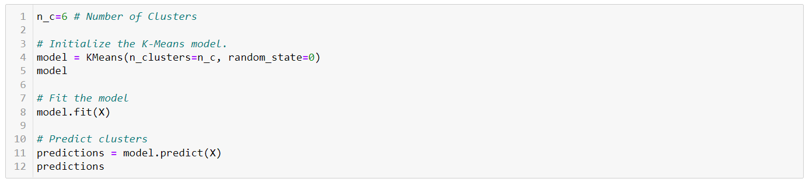

#### DataFrame with appended Class(cluster) column

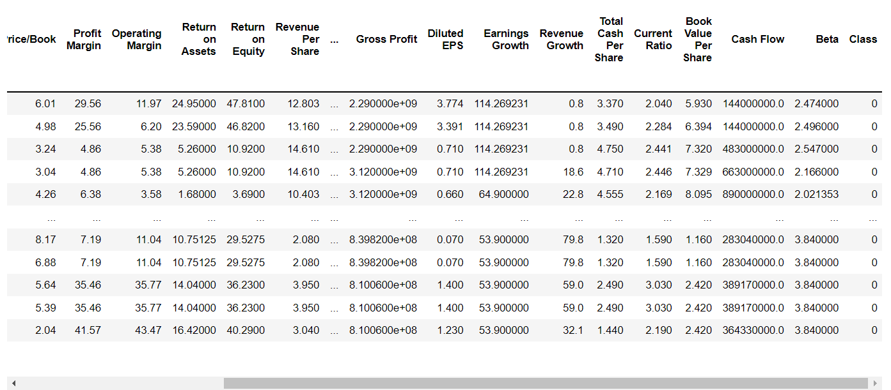

### Explanation of changes in model choice (if changes occurred between the Segment 2 and Segment 3 deliverable)

Initially, the model was developed based on 8 features:

- Trailing P/E
- Return on Assets
- Return on Equity
- Forward P/E
- PEG Ratio
- Enterprise Value/EBITDA
- Diluted EPS
- Earnings Growth

We have also used the SELU activation functions in layers 2 & 3 and in the output layer of the model.

The initial model accuracy was lower than expected at 0.07 Adjusted R-Sqaure. Hence, we have expanded the list of features and replaced the SELU activation function with RELU at all layers, which generated higher accuracy.

Another major change described in **Data Transformation** section was introducing initial data transformation with unsupervised learning breaking the data into 6 clusters and fitting individual model for each cluster.

### Description of how we have trained the model thus far, and any additional training that will take place

Before training the model, we ensured that the data was clean and separated it into Trainign and Test datasets (see **Description of how data was split into training and testing sets**). The datasets have been normalized with the StandardScaler (see **Description of preliminary data preprocessing**). Then, the datasets have been clustered into 6 clusters based on the unsupervised machine learning model (see **Data transformation**).

**Data Scaling**

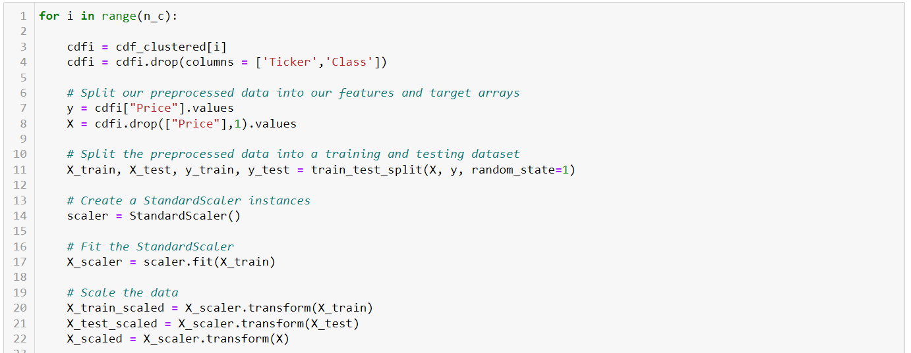

For each Cluster, a unique Deep Learning Model has been trained based on the Cluster data subset. The Models for each Cluster have been saved (total of 6). The Scalers for each Cluster have been saved (total of 6).

For new stock tickers that are not part of the overall dataset and may be potentially entered by the App users, a 7th model has been trained. The 7th model is based on the overall dateset (without clustering). Both, the model and scaler have also been saved.

The model training was conducted on 100 epochs. The **loss function** (*mean_absolute_error*) has shown the following improvements for each cluster model:

1. Model 0: Epoch 1: 25.7397; Epoch 100: 4.3742
2. Model 1: Epoch 1: 57.4215; Epoch 100: 18.8826
3. Model 2: Epoch 1: 47.7136; Epoch 100: 11.2194
4. Model 3: Epoch 1: 42.6148; Epoch 100: 2.6821
5. Model 4: Epoch 1: 40.5972; Epoch 100: 6.6608
6. Model 5: Epoch 1: 44.1796; Epoch 100: 7.3443
7. Model 6: Epoch 1: 27.2992; Epoch 100: 7.3515

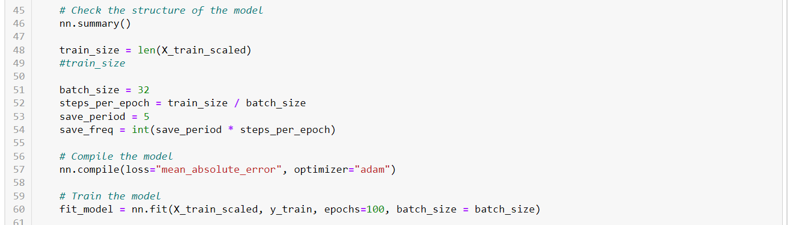

### Description of current accuracy score (Model Evaluation)

Adjusted R-Square has been used to evaluate the each Model accuracy. 

R Square measures how much variability in dependent variable can be explained by the model. It is the square of the Correlation Coefficient(R). It is is a good measure to determine how well the model fits the dependent variables. However, it does not take into consideration of overfitting problem. 

In our case, the regression model has many feature (independent) variables and it may fit well to the training data but performs badly for testing data. As a result, the Adjusted R Square has been used to prevent potential overfitting issues.

The R-Square results for each model are shown below.

1. Model 0: 0.34

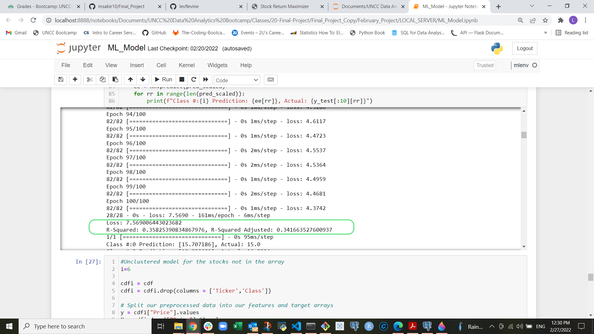

2. Model 1: 0.23

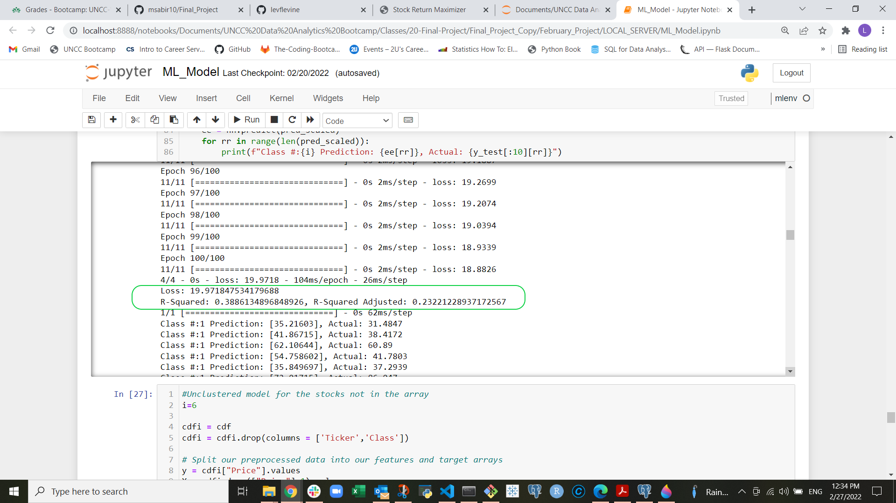

3. Model 2: 0.71

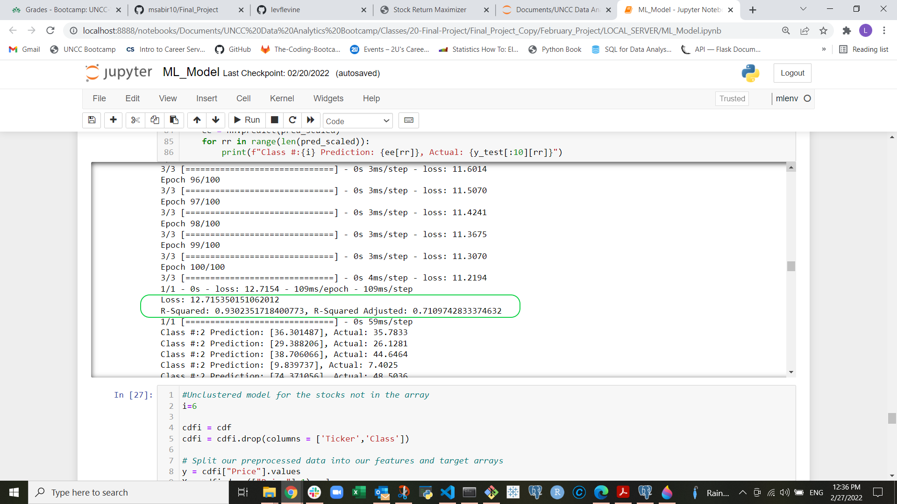

4. Model 3: 0.99


5. Model 4: 0.37

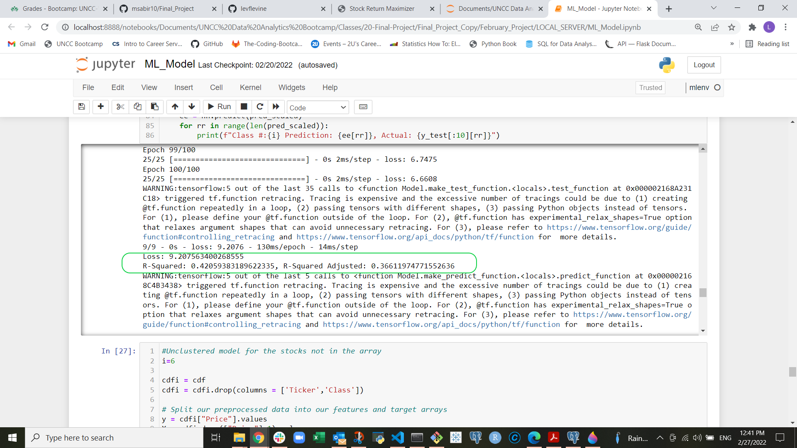

6. Model 5: 0.62


7. Model 6: 0.33

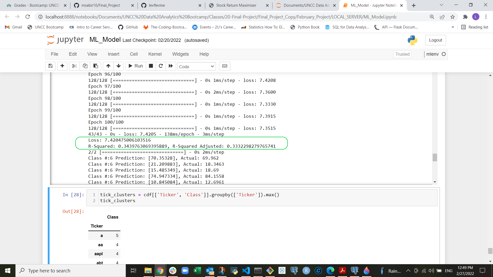

### Overall User Experience

#### A. Explore individual stock ticker (Core Product Feature)

1. Enter stock ticker
2. The backend will pull the most recent feature data and target variable data from Yahoo Finance
3. The DL Model will calculate the predicted stock price base on the most current feature data
4. The predicted and current stock price are displayed for the user
5. If predicted stock price > current stock price, a BUY recommendation generated and vise versa

```diff
- ### App Deployment on HEROKU 
```
[https://stockoptimizer.herokuapp.com/](https://stockoptimizer.herokuapp.com/)

### App User Interface

#### Stock Ticker Entry Screen
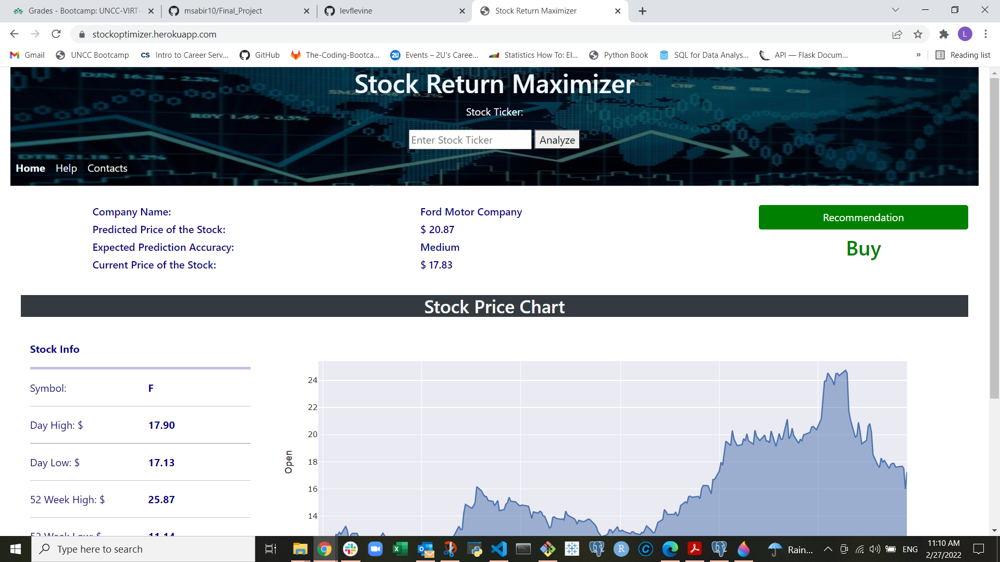

#### Stock Chart Screen


#### Help Screen
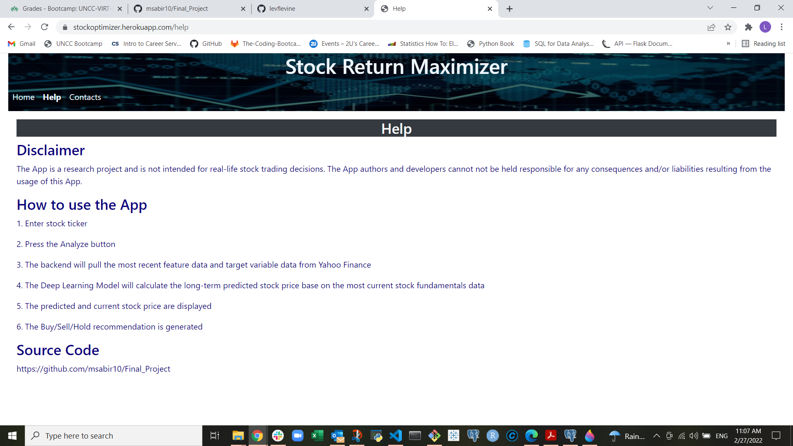

#### Contacts Screen
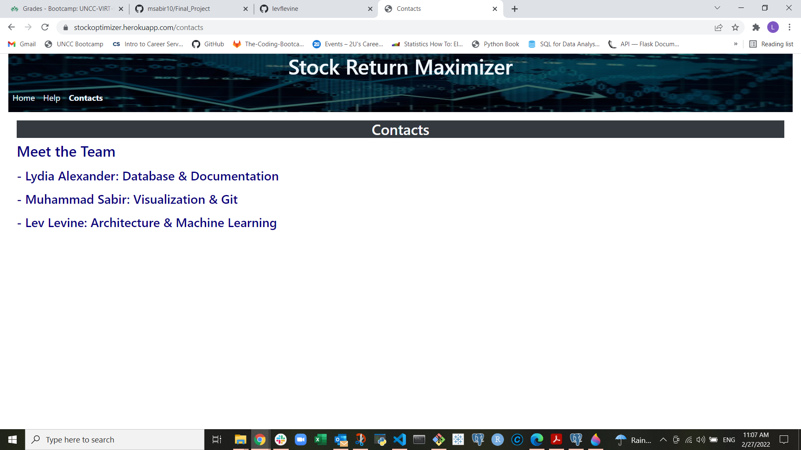

## Dashboard

### Storyboard on Google Slides

https://docs.google.com/presentation/d/1hXU28unDzPH3O0gM9gG7vCKDZXwtV4GZLEZ8WskptY0/edit?usp=sharing

### Description of the tool(s) that are used to create final dashboard
NEED DESCRIPTION

We used Java Script and Python Script to create our dashboard.

Plotly was used in our code to create an interactive graph based on input of the user.

1. HTML
2. CSS
3. Java Script
4. Flask
5. Python Scripts

### Description of interactive element(s)
When opening the homepage the user is greeted with a banner on top with title "Stock Return Optimizer".  Below the title the website will return recommendation for the ticker "adbe" automatically.  To get recommendations for a different ticker the user must enter the ticker in the open text block and click the "Fetch Stock" button to run analysis on the specified stock.

For the charting interface, the user must input the ticker, period of time and interval of price pulls.  By inserting the values in these 3 fields and clicking "fetch stock", a chart will generate.

### Images from the initial analysis
NEED

